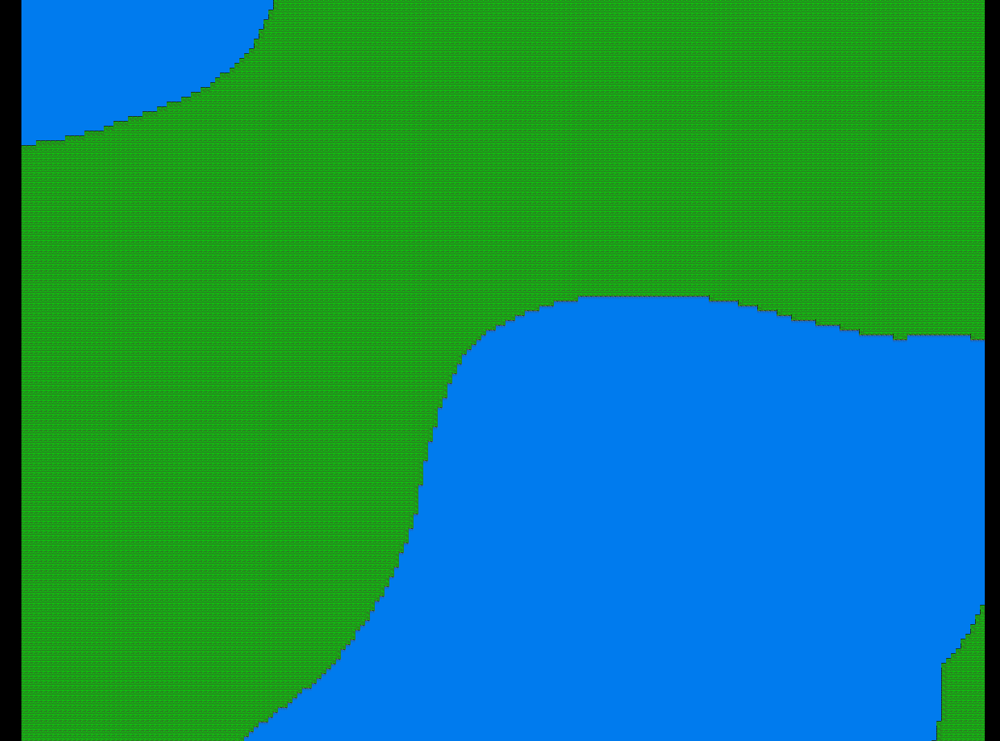

# NoGame

NoGame is a computer "game" created for education and research and based on ideas of:
- Minimalism
- Suprematism
- Absurdism
- Open World


Thanks a ton [Ivan Voirol](https://opengameart.org/users/ivan-voirol), for amazing and captivating [Slates tileset](https://opengameart.org/content/slates-32x32px-orthogonal-tileset-by-ivan-voirol).


## First screens




## Run from sources

Init and activate virtual env (optional):
```
virtualenv .venv
source .venv/bin/activate
```

Install dependencies:
```
pip3 install -r requirements.txt
```

Run:
```
python game.py
```
